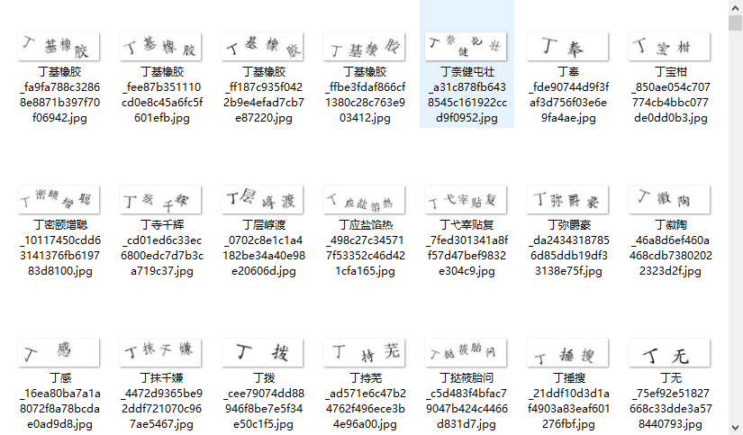
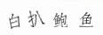

# <center>验证码之旋转印刷文字识别实战</center>
文本主要描述旋转印刷文字验证码的识别训练，适读人群为有识别验证码经验人群或当前寻找验证码项目试手人群。本文采用CRNN+CTC对文字进行识别，通过训练已对样例数据的识别率达到了97%。本文主要以实战代码展示的形式叙述整个项目的过程，方便大家理解和尝试。

## 环境相关
python 3.6.5
lmdb==1.0.0
opencv-python==4.4.0.44
Pillow==8.0.0
torch         1.6.0
torchvision   0.7.0
## 测试模型
提供一个简单测试的模型用于代码调试（<a href="https://pan.baidu.com/s/1SUr86_dyC3EDmGKMOPi_bw">百度云</a>模型【提取码：4086】）
加群分享测试接口用于测试完整模型（训练集82w张图片，测试集2w张图片，识别率97%的测试接口），或者加群分享部分数据集，完整数据集可联系群主。
```python
# 测试出现---------------------- => 表示代码流程和环境没有问题
python demo.py -m /expr/netCRNN_10_1.pth -i demo/1c16c4acb9f539222dcf0fc029b733a5.jpg
# 拔丝苹果---------------------- => 拔丝苹果
```
## 训练模型
```python
# 生成用于训练的mdb文件--out文件输出路径， --folder数据集存放路径， 用此指令生成训练集文件和测试集文件
python tool/create_dataset.py --out data/train --folder path/to/folder
# 用于生成所有文字的映射文件，--trainfolder训练集路径,--testfolder测试集路径
python tool/select_words.py --trainfolder /path/train --testfolder path/test
# 训练模型--trainroot用于训练的mdb路径，--valroot用于测试的mdb训练路径
python train.py --trainroot data/train --valroot data/test
```
数据集展示 

  

数据样式 

 
## params.py部分训练参数详解
```python
cuda = True # 是否使用GPU训练
multi_gpu = False # 是否使用多GPU进行训练
ngpu = 1 # 多GPU训练时的gpu数量
workers = 0 # 加载数据的worker，在机器允许的情况下设为8或16，降低CPU调度，提高训练效率

# training process
displayInterval = 100 # 每隔多少次训练展示损失率
valInterval = 1000 # 每隔多少次训练测试模型
saveInterval = 10 # 每隔多少次循环保存模型

nepoch = 1000 # 数据集最大循环训练次数
```
## 项目参考
crnn-pytorch： https://github.com/Holmeyoung/crnn-pytorch
## 项目讨论
